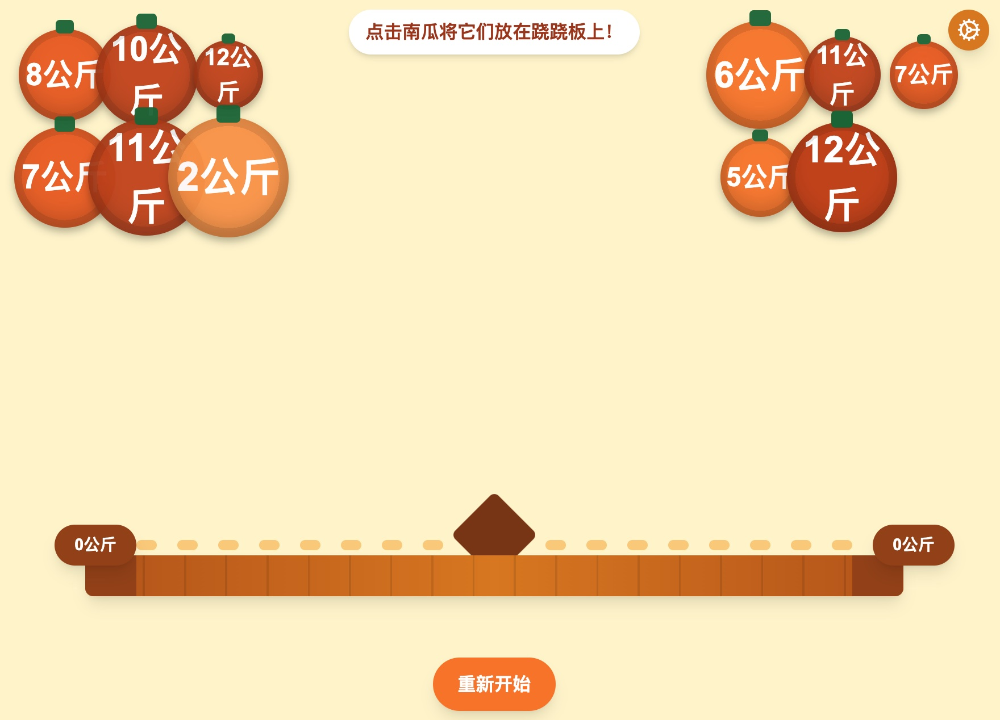
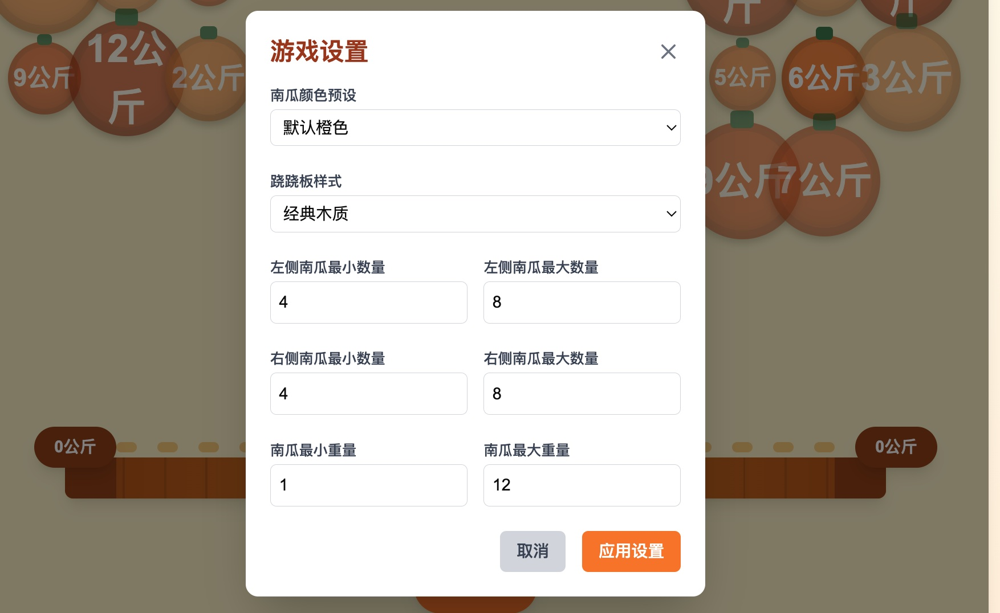

# 🎃 南瓜跷跷板游戏（Seesaw Game）
一个寓教于乐的互动小游戏，帮助儿童通过点击选择南瓜到跷跷板两侧，直观地理解重量与数字大小的关系。点击左侧或者右侧上方的南瓜，南瓜会掉落到左侧或者右侧对应的跷跷板上，跷跷板会平滑的弹起或者落下，通过调准南瓜的数量，使跷跷板达到平衡，最终获得游戏的成功。




## 📌 南瓜跷跷板游戏项目简介

一个寓教于乐的互动小游戏，帮助儿童通过拖放南瓜到跷跷板两侧，直观地理解重量与数字大小的关系。

点击设置按钮，可以设置南瓜的样式以及南瓜的重量，还可以设置跷跷板的样式！



### ✨ 游戏特色
 - **互动性强**：点击南瓜将其放置在跷跷板上，观察跷跷板的动态变。
 - **寓教于乐**：通过游戏方式帮助儿童理解重量和数字的概。
 - **跨平台支持**：兼容主流桌面和移动浏览。
 - **自定义设置**：可以自定义南瓜的样式和重量，以及跷跷板的样式。

## 🚀 快速开始

### 📦 克隆项目

```bash
git clone https://github.com/your-username/seesaw-game.git
cd seesaw-game
bun install # 安装依赖
```

### 💻 本运行

使用任意本地服务器工具启动项，例如

```bash
bun run dev
```

然后在浏览器中访问 `http://localhost:3000` 即可始游戏。


如果您喜欢这个项目，请点击右上角的 ⭐️Star 支持一下！您的支持是我们持续改进的动力。感谢您的关注与支持！